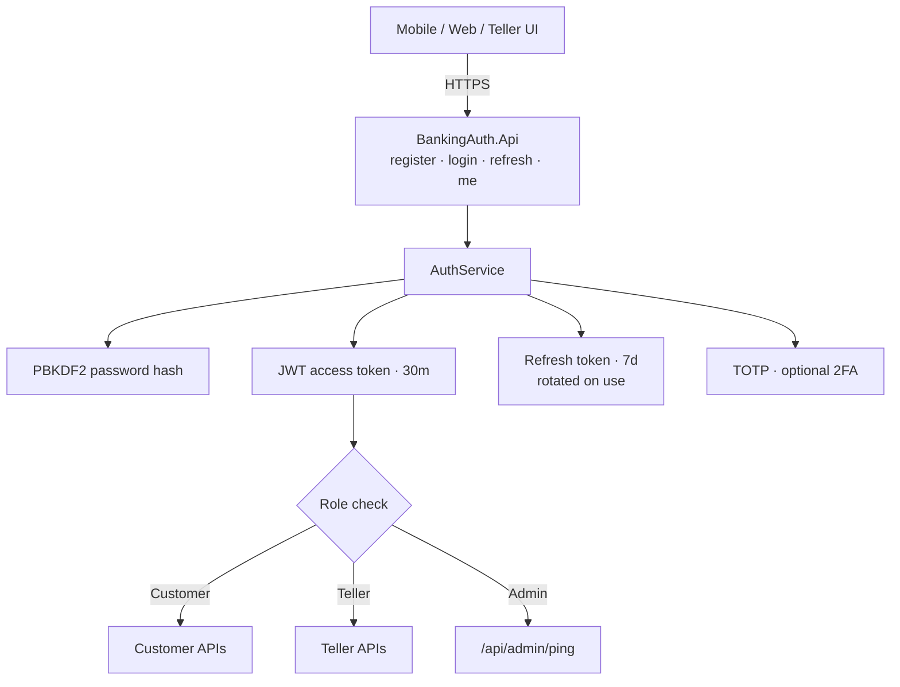
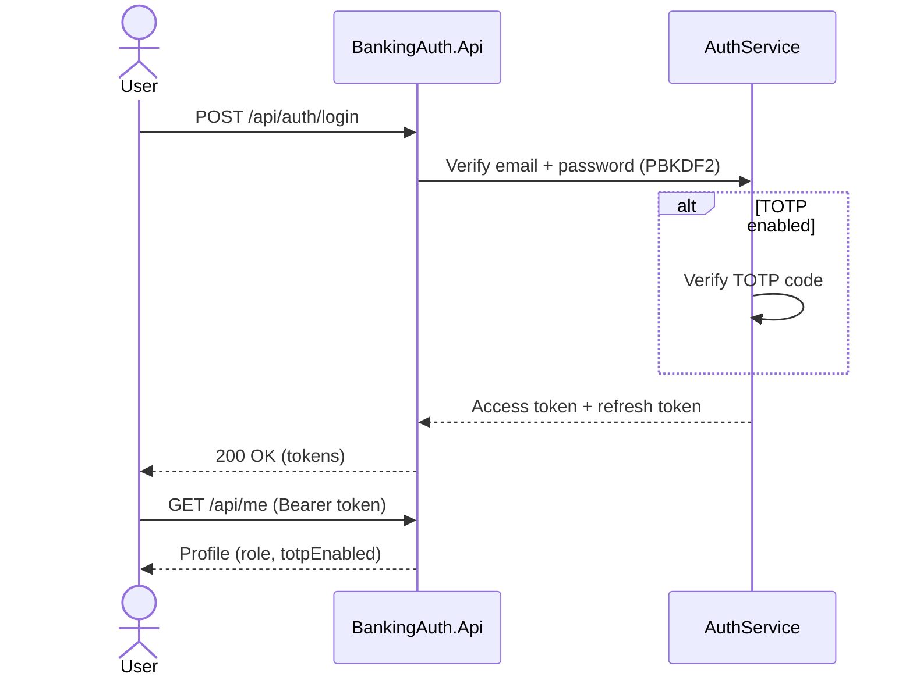

# Banking Auth Service

Authentication and authorization microservice for banking channels.

Built with **.NET 10**, JWT access tokens, refresh-token rotation, role-based access (`Customer` / `Teller` / `Admin`), and optional **TOTP 2FA**.

## Architecture



Login flow:



## Features

- User registration with PBKDF2 password hashing
- Login with JWT access token (30 minutes) + refresh token (7 days)
- Refresh-token rotation (old token revoked after use)
- TOTP setup + confirmation (Google Authenticator compatible)
- Role-protected admin endpoint
- OpenAPI document included

## Quick start

```bash
dotnet restore
dotnet test
dotnet run --project BankingAuth.Api
```

Optional config (`appsettings.Development.json`):

```json
{
  "Jwt": {
    "SigningKey": "replace-with-a-long-random-secret-key"
  }
}
```

## Example flow

```bash
# Register
curl -s -X POST http://localhost:5080/api/auth/register \
  -H "Content-Type: application/json" \
  -d "{\"email\":\"alice@example.com\",\"password\":\"Secret123!\",\"role\":\"Customer\"}"

# Login
curl -s -X POST http://localhost:5080/api/auth/login \
  -H "Content-Type: application/json" \
  -d "{\"email\":\"alice@example.com\",\"password\":\"Secret123!\"}"

# Profile (Bearer access token)
curl -s http://localhost:5080/api/me -H "Authorization: Bearer <access_token>"
```

### Enable 2FA

1. Login and call `POST /api/auth/totp/setup` with Bearer token
2. Scan / enter `sharedSecret` in an authenticator app
3. Confirm with `POST /api/auth/totp/confirm` `{ "code": "123456" }`
4. Later logins require `totpCode` in the login body

## API

| Method | Path | Auth | Description |
|--------|------|------|-------------|
| `POST` | `/api/auth/register` | No | Create user |
| `POST` | `/api/auth/login` | No | Issue tokens |
| `POST` | `/api/auth/refresh` | No | Rotate refresh token |
| `POST` | `/api/auth/totp/setup` | Yes | Begin TOTP enrollment |
| `POST` | `/api/auth/totp/confirm` | Yes | Confirm TOTP |
| `GET` | `/api/me` | Yes | Current profile |
| `GET` | `/api/admin/ping` | Admin | Role check |
| `GET` | `/health` | No | Health check |

## Security notes

- Demo storage is in-memory (restart clears users)
- Replace the JWT signing key before any shared deployment
- TOTP uses a 1-step verification window

## Tests

```bash
dotnet test
```

## License

MIT — see [LICENSE](LICENSE).
