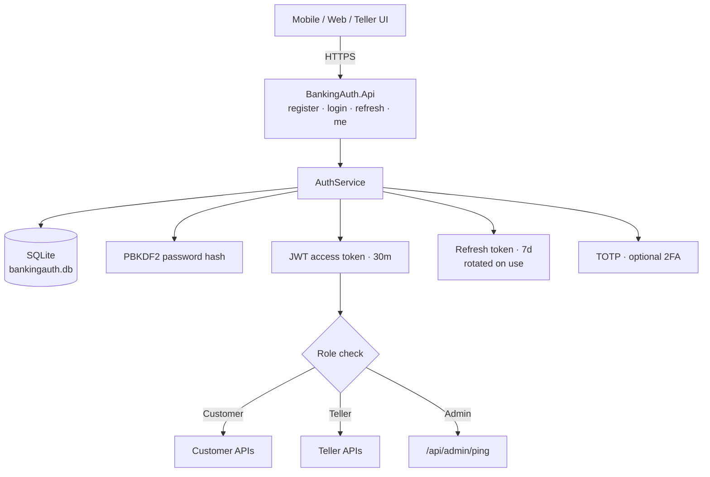
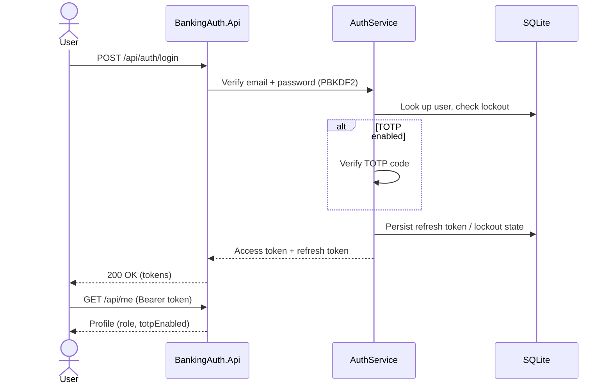
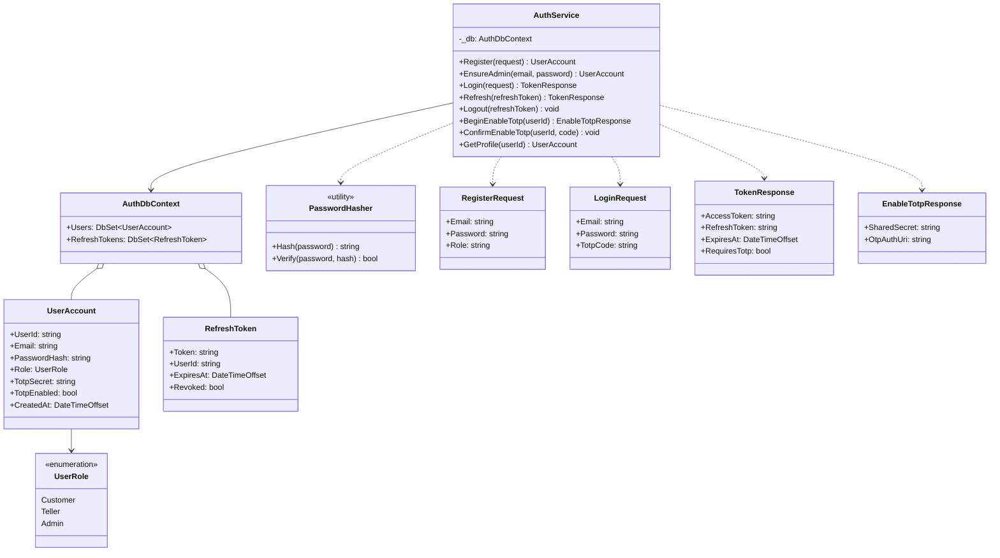

# Banking Auth Service

An MVP authentication and authorization service for a banking-style backend. It is a learning /
portfolio project, not a production bank system: treat it as a solid starting point for JWT +
refresh-token auth with role-based access, not as a finished product.

Built with **.NET 10**, JWT access tokens, refresh-token rotation, role-based access
(`Customer` / `Teller` / `Admin`), optional **TOTP 2FA**, and **EF Core + SQLite** for durable
storage (a file-based database, no external DB server needed).

## Architecture



Login flow:



## Features

- User registration with PBKDF2 password hashing (`Customer` / `Teller` only; Admin is not
  self-service, it is seeded from config on startup)
- Login with JWT access token (30 minutes) + refresh token (7 days)
- Refresh-token rotation (old token revoked, new one issued, in a single DB transaction)
- TOTP setup + confirmation (Google Authenticator compatible)
- Role-protected Customer, Teller and Admin demonstration endpoints
- Five-failure, 15-minute account lockout and letter-plus-digit password policy
- Refresh-token logout/revocation and security response headers
- Durable storage via EF Core + SQLite (users and refresh tokens survive a restart)
- OpenAPI document mapped in every environment

## Diagrams

Architecture and UML diagrams are in [docs/architecture.md](docs/architecture.md) and [docs/uml.md](docs/uml.md). A standalone index is available at [docs/index.html](docs/index.html).



## Quick start (local .NET)

```bash
dotnet restore
dotnet test
dotnet run --project BankingAuth.Api
```

API base URL (HTTP): `http://localhost:5049`

On startup the API creates the SQLite schema if it doesn't exist yet
(`BankingAuth.Api/bankingauth.db`, gitignored) and seeds an Admin account from
`Admin:Email` / `Admin:Password` (defaults `admin@example.com` / `Admin123!`) via
`EnsureAdmin`. Use that account for `GET /api/admin/ping`.

The `Jwt:SigningKey` used in Development comes from `appsettings.Development.json`
(a placeholder value, fine for local use only). Outside Development the API **requires**
`Jwt:SigningKey` / `Jwt__SigningKey` to be set explicitly and refuses to start otherwise -
see [Security notes](#security-notes).

## Run with Docker

```bash
echo "JWT_SIGNING_KEY=replace-with-a-long-random-secret-at-least-32-chars" > .env
docker compose up --build
```

This builds the API image and runs it on `http://localhost:8080`, with the SQLite file
persisted in the `banking-auth-data` named volume (mounted at `/data` in the container), so
data survives `docker compose down` / `up` cycles. `JWT_SIGNING_KEY` is required; the container
fails fast on startup if it's missing (see `docker-compose.yml`).

## Example flow

```bash
# Register (Customer or Teller only)
curl -s -X POST http://localhost:5049/api/auth/register \
  -H "Content-Type: application/json" \
  -d "{\"email\":\"alice@example.com\",\"password\":\"Secret123!\",\"role\":\"Customer\"}"

# Login
curl -s -X POST http://localhost:5049/api/auth/login \
  -H "Content-Type: application/json" \
  -d "{\"email\":\"alice@example.com\",\"password\":\"Secret123!\"}"

# Profile (Bearer access token)
curl -s http://localhost:5049/api/me -H "Authorization: Bearer <access_token>"
```

### Enable 2FA

1. Login and call `POST /api/auth/totp/setup` with Bearer token
2. Scan / enter `sharedSecret` in an authenticator app
3. Confirm with `POST /api/auth/totp/confirm` `{ "code": "123456" }`
4. Later logins require `totpCode` in the login body

## API

| Method | Path | Auth | Description |
|--------|------|------|-------------|
| `POST` | `/api/auth/register` | No | Create user |
| `POST` | `/api/auth/login` | No | Issue tokens |
| `POST` | `/api/auth/refresh` | No | Rotate refresh token |
| `POST` | `/api/auth/logout` | No | Revoke a refresh token |
| `POST` | `/api/auth/totp/setup` | Yes | Begin TOTP enrollment |
| `POST` | `/api/auth/totp/confirm` | Yes | Confirm TOTP |
| `GET` | `/api/me` | Yes | Current profile |
| `GET` | `/api/admin/ping` | Admin | Role check |
| `GET` | `/api/customer/accounts/summary` | Customer or Admin | Mock account summary |
| `GET` | `/api/teller/customers/lookup?email=` | Teller or Admin | Mock customer lookup |
| `GET` | `/health` | No | Health check |

## Security notes

- Storage is SQLite via EF Core; refresh-token rotation runs inside an explicit DB transaction
  so a crash mid-rotation can't leave an old token revoked without a new one issued
- `Jwt:SigningKey` has **no fallback outside Development** - the app throws on startup if it's
  missing, instead of silently signing tokens with a weak default. In Development it falls back
  to a placeholder key (`appsettings.Development.json`) purely so `dotnet run` works out of the box
- Replace `Jwt:SigningKey` and the Admin bootstrap password before any shared/public deployment
- TOTP uses a 1-step verification window

## Tests

```bash
dotnet test
```

Includes unit tests for `AuthService`/`PasswordHasher`, `WebApplicationFactory`-based integration
tests for role isolation and security headers, and dedicated persistence tests that register a
user or issue a refresh token in one `AuthDbContext`/`WebApplicationFactory` instance, then open a
brand new one against the same SQLite file (simulating a restart) and prove login/refresh still
work. Every test class uses its own temp SQLite file so tests never share state.

CI (`.github/workflows/ci.yml`) restores, builds and runs the full test suite on `ubuntu-latest`
for every push/PR to `main`.

## License

MIT — see [LICENSE](LICENSE).
