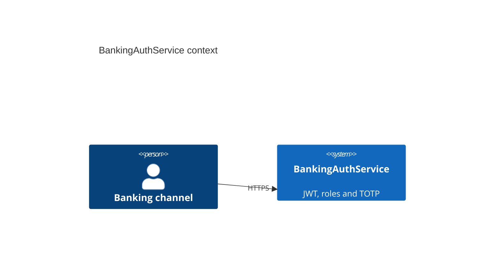
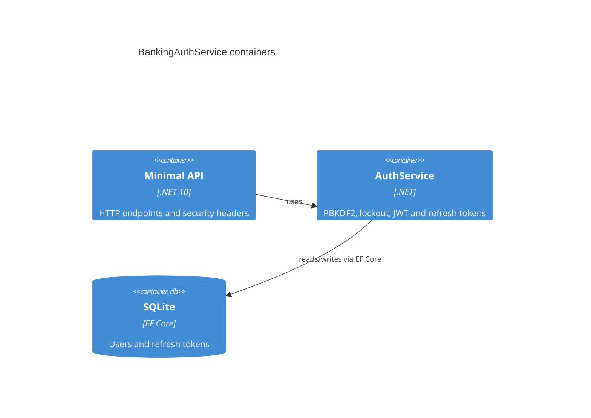
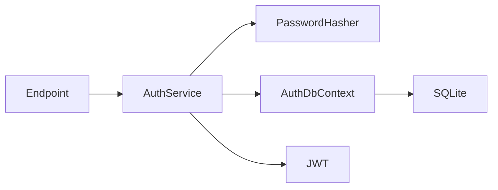

# Architecture

```mermaid
C4Context
  title BankingAuthService context
  Person(channel, "Banking channel")
  System(api, "BankingAuthService", "JWT, roles and TOTP")
  Rel(channel, api, "HTTPS")
```

```mermaid
C4Container
  title BankingAuthService containers
  Container(api, "Minimal API", ".NET 10", "HTTP endpoints and security headers")
  Container(service, "AuthService", ".NET", "PBKDF2, lockout, JWT and refresh tokens")
  ContainerDb(db, "SQLite", "EF Core", "Users and refresh tokens")
  Rel(api, service, "uses")
  Rel(service, db, "reads/writes via EF Core")
```

```mermaid
flowchart LR
  Endpoint --> AuthService --> PasswordHasher
  AuthService --> AuthDbContext --> SQLite
  AuthService --> JWT
```

Storage is EF Core + SQLite, file-based and durable; restarting the API keeps users and refresh
tokens. Refresh-token rotation runs inside an explicit database transaction.
