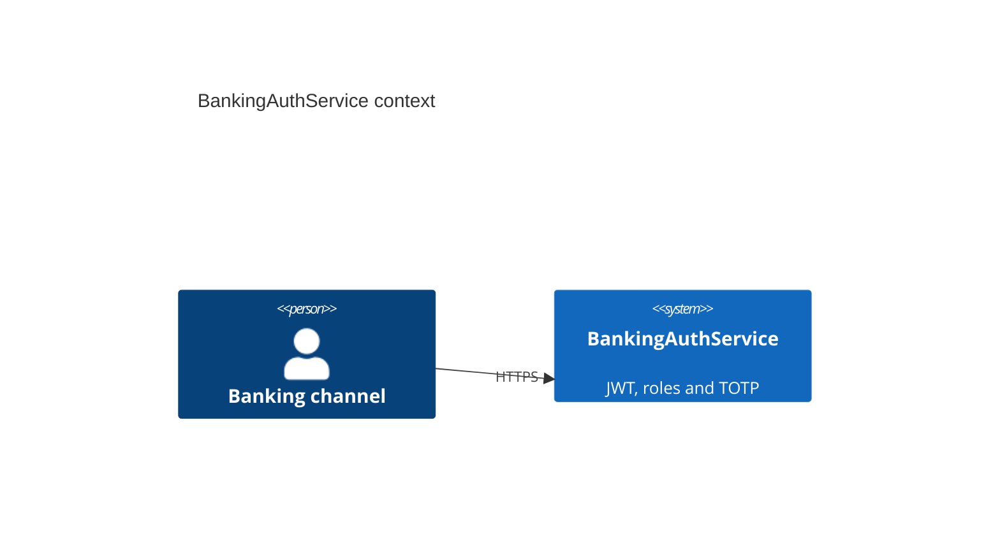
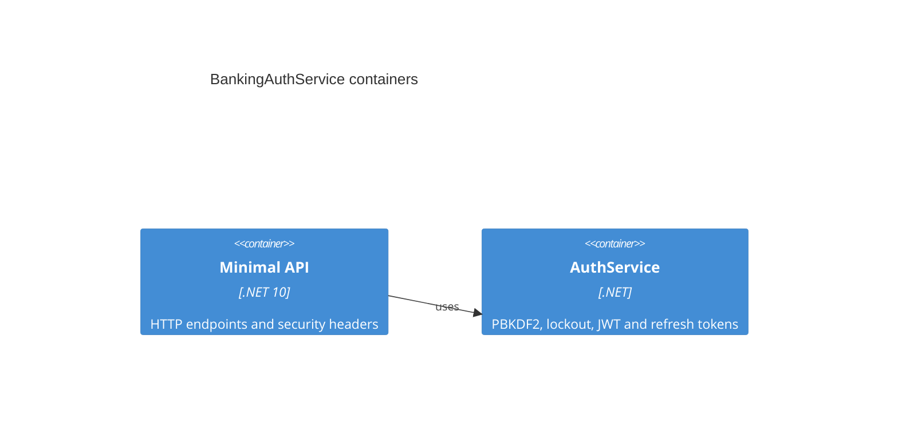
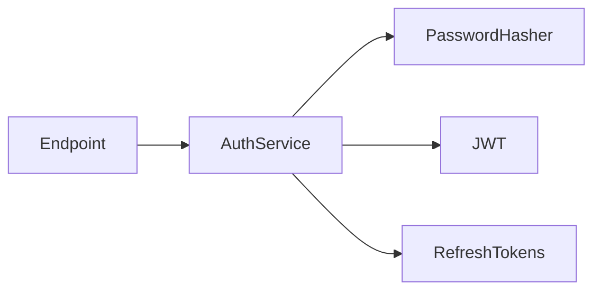

# Architecture

```mermaid
C4Context
  title BankingAuthService context
  Person(channel, "Banking channel")
  System(api, "BankingAuthService", "JWT, roles and TOTP")
  Rel(channel, api, "HTTPS")
```

```mermaid
C4Container
  title BankingAuthService containers
  Container(api, "Minimal API", ".NET 10", "HTTP endpoints and security headers")
  Container(service, "AuthService", ".NET", "PBKDF2, lockout, JWT and refresh tokens")
  Rel(api, service, "uses")
```

```mermaid
flowchart LR
  Endpoint --> AuthService --> PasswordHasher
  AuthService --> JWT
  AuthService --> RefreshTokens
```

Storage is in memory for a runnable demonstration; restarting the API clears users and refresh tokens.
