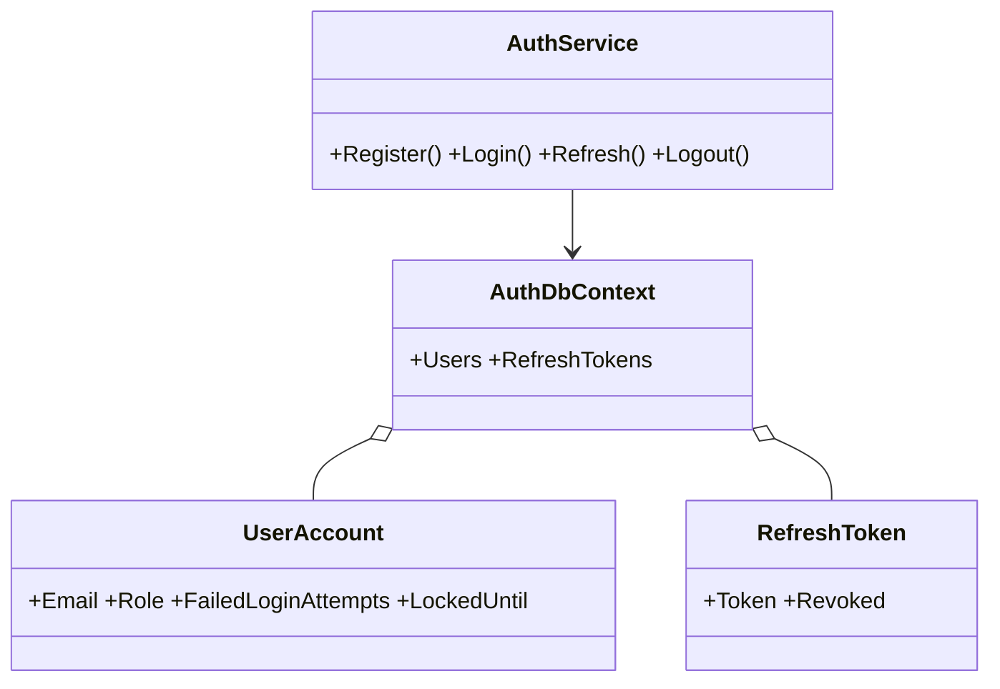
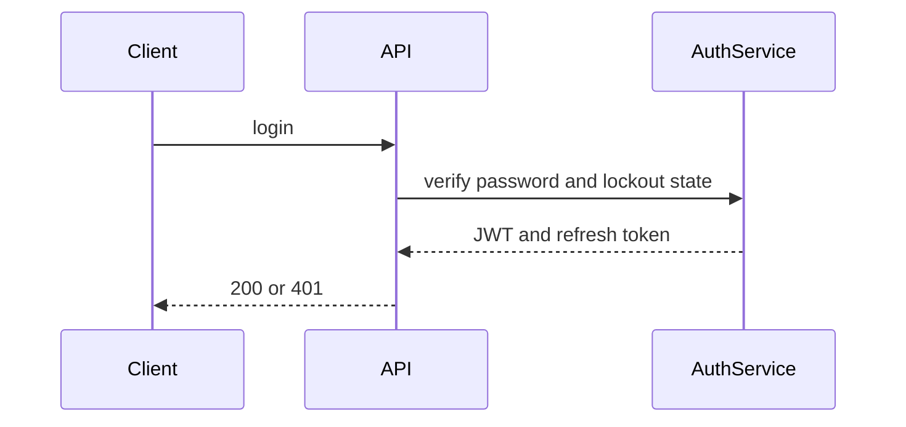

# UML

```mermaid
classDiagram
  class AuthService { +Register() +Login() +Refresh() +Logout() }
  class AuthDbContext { +Users +RefreshTokens }
  class UserAccount { +Email +Role +FailedLoginAttempts +LockedUntil }
  class RefreshToken { +Token +Revoked }
  AuthService --> AuthDbContext
  AuthDbContext o-- UserAccount
  AuthDbContext o-- RefreshToken
```

```mermaid
sequenceDiagram
  participant C as Client
  participant A as API
  participant S as AuthService
  C->>A: login
  A->>S: verify password and lockout state
  S-->>A: JWT and refresh token
  A-->>C: 200 or 401
```
